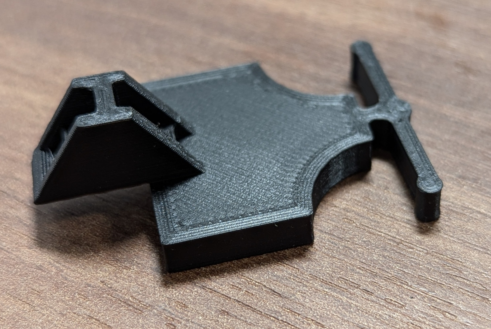

# SAAB 9-5 Cowl Plate Bracket (Part No. 4563409)

This repository contains an OpenSCAD model for the SAAB 9-5 Cowl Plate Bracket, part number **4563409**. This part is designed to be compatible with the SAAB 9-5. The model can be 3D printed to produce a functional part for your vehicle.

## Printing Recommendations

- **Material**: PETG or ABS.
- **Infill**: 50-75% for structural strength.
- **Supports**: Required for overhangs.

## Modyfing the model

1. Download [OpenSCAD](https://openscad.org/) - A free software for creating 3D CAD objects.
2. Open the .scad file

## Contributions

Contributions are welcome! Feel free to submit issues or pull requests to improve the design.

## Disclaimer

This model is provided "as is" without any guarantees. Use it at your own risk. Always ensure the printed part meets safety requirements for its intended use.
